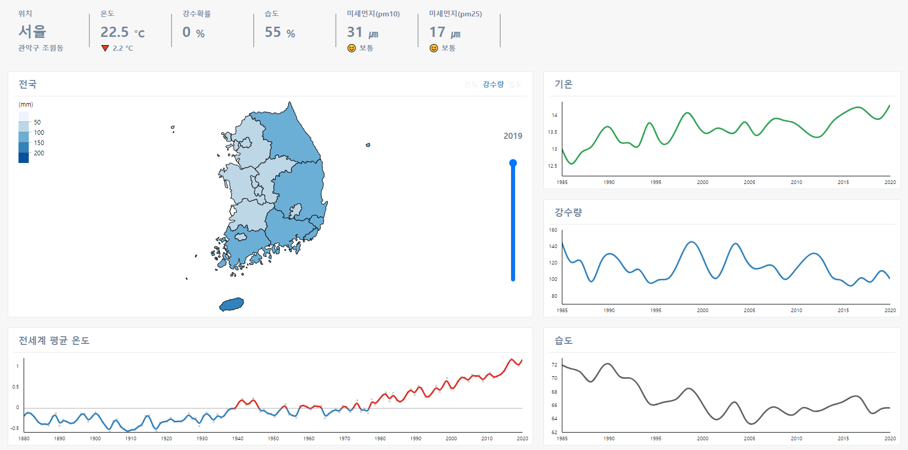

# Raccoon Weather Client

<a href="https://weather.dev-raccoon.site" target="_blank">Raccoon Weather 바로가기</a>

  

### Introduction

- 전국 날씨 정보를 보여주는 웹 사이트

### Features

- 사용자 지역의 현재 날씨 제공
- D3를 이용한 지도, 그래프 에니메이션
- 지도 선택시 해당 지역의 날씨 그래프로 변경
- 전세계 평균 온도 그래프 제공

### Tech

- React, TypeScript, Mobx, Scss, D3, S3, CloudFront

### More Info

<a href="https://www.notion.so/Raccoon-Weather-Client-2020-09-33cd4e898a4b47668965e0d67755d4eb" target="_blank">Notion Portfolio</a>
